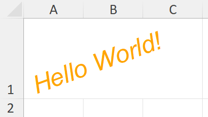
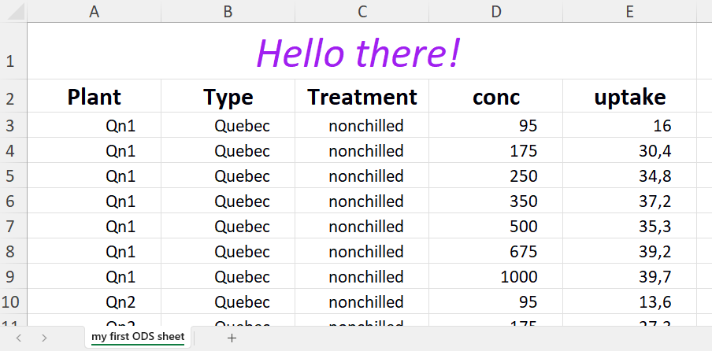

# prettyODS: Creating OpenDocument Spreadsheet ('.ods') files using R

<!-- badges: start -->

<!-- badges: end -->

There is currently no straightforward way to create OpenDocument Spreadsheet ('.ods') files from R with good control over text styles, sheet styles, and other formatting. **prettyODS** is an **early prototype** and the first step toward a fully featured R package that provides these capabilities.

The goal is to find a good balance between ease of use and flexibility, covering all common formatting needs and making it easy to create 
<b><i>
<span style="color:red;">p</span><span style="color:orange;">r</span><span style="color:#d4c000;">e</span><span style="color:green;">t</span><span style="color:blue;">t</span><span style="color:purple;">y</span>
</i></b>
ODS files.


## Installation

You can install the development version of prettyODS from [GitHub](https://github.com/) with:

``` r
# install.packages("pak")
pak::pak("Jakob256/prettyODS")
```

## Hello World

``` r
library(prettyODS)

sheet <- ODS_createSheet()
orangeStyle <- ODS_createStyle(font="Arial", size=20, italic=TRUE, rotate=20, color="orange")

ODS_writeCell(sheet, "Hello World!", row=1, col=1, orangeStyle)
ODS_write(sheet)
```
This creates `file.ods`:

<p align="center" width="100%">

</p>

---

# A Short Overview

Let's give a quick introduction in how to use this package:

## Sheet

In the beginning, there was the **sheet**. We'll create it and assign it its name:

``` r
sheet <- ODS_createSheet(sheetName = "my first ODS sheet")
```

We will soon write data to it, and later export it as an '.ods' file.
At any point, `preview(sheet)` shows a preview of the sheet's current contents (uses RStudio's Data Viewer).
Also, `nrow(sheet)` and `ncol(sheet)` work as one would expect. Now, before we fill it with content, we'll define ...

## Styles

**Styles** tell us *how* text/numbers should be displayed (font/size, etc.).

``` r
myFirstStyle <- ODS_createStyle(size=26, italic=TRUE, color="purple", hAlign="middle")
```

Its arguments include:

| Argument | Description | Examples |
|---|---|---|
| `font` | Font family | `"Arial"`, `"Calibri"`, `"Times New Roman"` |
| `size` | Text size in pt | `12`|
| `color` / `cellcolor` | Text color / cell background color | `"darkblue"`, `"#33ee55"`, any color from `grDevices::colors()` |
| `italic` / `bold` / `underline`  | italic / bold / underlined text | `TRUE` / `FALSE` |
| `vAlign` | Vertical alignment | `"bottom"`, `"top"`, `"middle"` |
| `hAlign` | Horizontal alignment | `"left"`, `"right"`, `"middle"` |
| `digits` | Number of decimal places to display. By default, numbers are displayed with as many decimal places as necessary. | `0`, `1`, `2`, ... |
| `margin` | Cell margin (in cm) | `0.2` |
| `wrap` | Wrap text within the cell | `TRUE` / `FALSE` |


Now that we know how things should look, we can talk about the ... 

## Content

If we want to fill a single cell, we can use:

``` r
ODS_writeCell(sheet, data = "Hello there!", row = 1, col = 1, style = myFirstStyle)
``` 

However, you probably want to write multiple values at once. You can write `vectors`, `matrices` or `data.frames` (also `data.table` and `tibble`) using `ODS_writeData`.
Writing the table `datasets::CO2` could look like:

``` r
style <- ODS_createStyle(hAlign = "right", margin = 0.7)
styleColnames <- ODS_createStyle(bold = TRUE, size = 15, hAlign = "middle")

ODS_writeData(sheet, data = datasets::CO2, startRow = 2, useColnames = T,
              style = style, styleColnames = styleColnames)
``` 


## Additional Options

We can set the row heights and column widths using `ODS_setRowHeights` and `ODS_setColWidths` respectively.
Also, we can merge cells with `ODS_mergeCells`. So let's use them:

``` r
ODS_setColWidths(sheet, cols = 1:5, width = 2.8, unit = "cm")
ODS_mergeCells(sheet, rows = 1, cols = 1:5)
```

## Writing

After executing the above code, we can create the promised ODS file using:

``` r
ODS_write(sheet,"example.ods")
```

<p align="center" width="100%">

</p>

